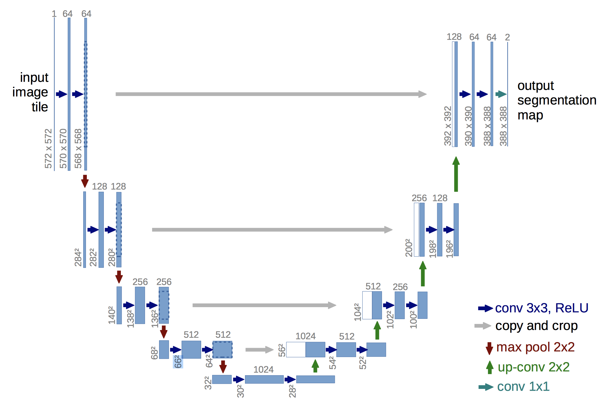
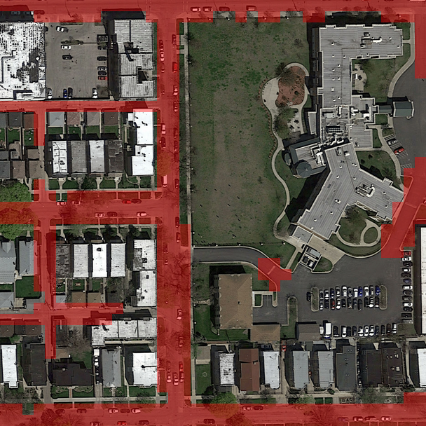
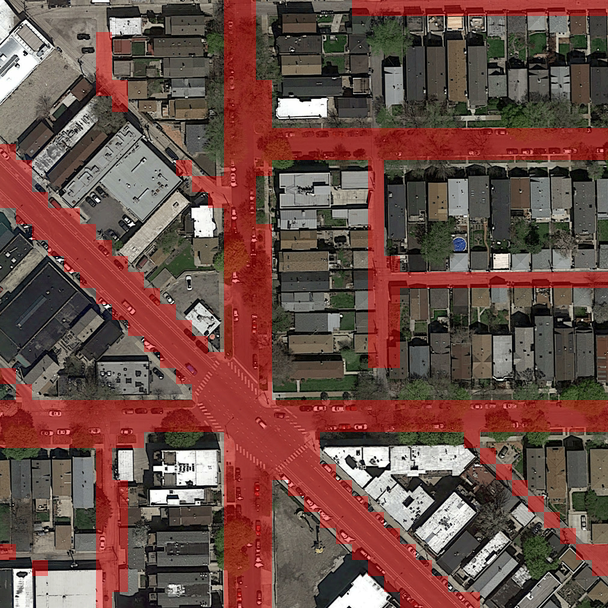
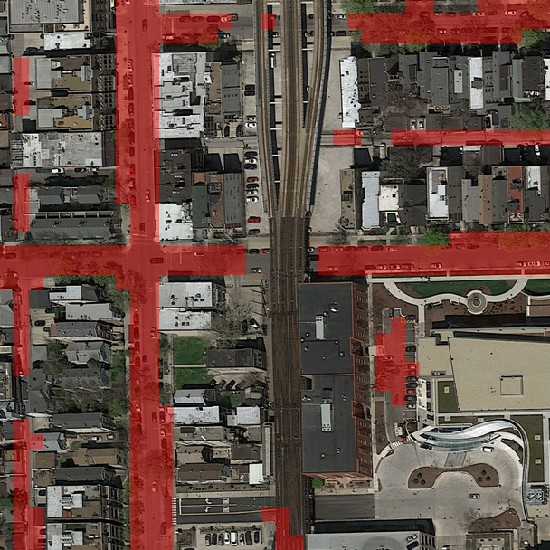

# Unet for Road Segmentation
We built and trained a Convolutional Neural Network in Tensorflow to segment roads on satellite images,
i.e. assign labels `road=1`, `background=0` to each pixel. We implemented a convolution/deconvolution U-Net with dilated layers from [Ronneberger et al. (2015)](https://arxiv.org/pdf/1505.04597.pdf). Data augmentation was a key element for performance improvement, we applied rotations, mirroring extension and vertical/horizontal flips.




The train and evaluation [data](https://github.com/aschneuw/ml-chiefs/tree/master/data) contains 100 and 50 images of size 400x400 and 604x604 respectively. These are some samples of our predictions on evaluation images:

|  |  |
| :--------------------------------------: | :--------------------------------------: |
|  |  |

Consult our [report](https://github.com/aschneuw/ml-chiefs/blob/master/report/report.pdf) for further information. 

*This project was part of the Machine Learning course taught at [EPFL](https://www.epfl.ch) by Prof. Urbanke and Prof. Jaggi.*

### Contributors

- Arno Schneuwly [@aschneuw](https://github.com/aschneuw)
- Jean-Baptiste Cordonnier [@jbcdnr](https://github.com/jbcdnr)
- Joey Zenhäusern [@zenhaeus](https://github.com/zenhaeus)

### Setup Environment
Our setup requires a Default Unix Environment (Ubuntu 16.04, or MAC OS X) with an installed Pyhton 3.5 or 3.6 Environment. Our implementation also requires the command `sha256sum` which is integrated OOB in Ubuntu. If you use OS X or Windows, install the command or do the model verification by computing the SHA256 with the appropriate tools. (Read more about model verification below)


The necessary can easily be setup using `pip` and the provided `requirements.txt`.
```bash
   pip install -r requirements.txt
```

### Run

To generate our final Kaggle submission execute:

   ```bash
./run.py
   ```

The predictions and the submission file are saved in the folder `prediction/`

### Train a new model
To train a new model, you may run:


   ```bash
python3 src/tf_aerial_images.py \
        --train_data_dir ./data/training/ \
        --save_path=./runs \
        --logdir=./logdir \
        --num_epoch=25 \
        --batch_size=1 \
        --patch_size=388 \
        --gpu=1 \
        --eval_every=1000 \
        --stride=12 \
        --train_score_every=10000 \
        --image_augmentation \
        --rotation_angles 15,30,45,60,75 \
        --ensemble_prediction \
        --dilated_layers \
        --num_layers=6 \
        --dropout=1.0
   ```

To inspect the model during and after training, use tensorboard:


   ```bash
tensorboard --logdir=./logdir
   ```

### Flags

When running `tf_aerial_images.py`, the following flags may be set to control the application behavior:

| Flag                 | Description                              |
| -------------------- | ---------------------------------------- |
| batch_size           | Batch size of training instances         |
| dilated_layers       | Add dilated CNN layers                   |
| dropout              | Probability to keep an input             |
| ensemble\_prediction | Enable ensemble prediction               |
| eval\_data\_dir      | Directory containing eval images         |
| eval\_every          | Number of steps between evaluations      |
| eval\_train          | Evaluate training data                   |
| gpu                  | GPU to run the model on                  |
| image\_augmentation  | Augment training set of images with transformations |
| interactive          | Spawn interactive Tensorflow session     |
| logdir               | Directory where to write logfiles        |
| lr                   | Initial learning rate                    |
| model\_path          | Restore exact model path                 |
| momentum             | Momentum                                 |
| num\_epoch           | Number of pass on the dataset during training |
| num\_eval\_images    | Number of images to predict for an evaluation |
| num\_gpu             | Number of available GPUs to run the model on |
| num\_layers          | Number of layers of the U-Net            |
| patch\_size          | Size of the prediction image             |
| pred\_batch\_size    | Batch size of batchwise prediction       |
| restore\_date        | Restore the model from specific date     |
| restore\_epoch       | Restore the model from specific epoch    |
| restore\_model       | Restore the model from previous checkpoint |
| root\_size           | Number of filters of the first U-Net layer |
| rotation\_angles     | Rotation angles                          |
| save\_path           | Directory where to write checkpoints, overlays and submissions |
| seed                 | Random seed for reproducibility          |
| stride               | Sliding delta for patches                |
| train\_data\_dir     | Directory containing training images/ groundtruth/ |
| train\_score\_every  | Compute training score after the given number of iterations |
